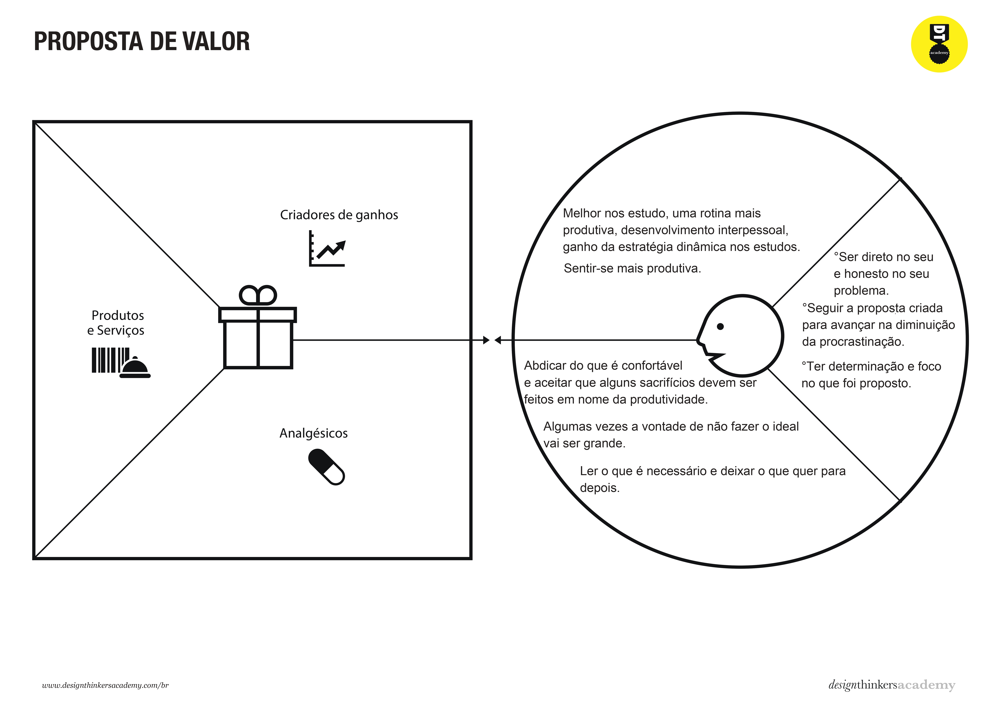
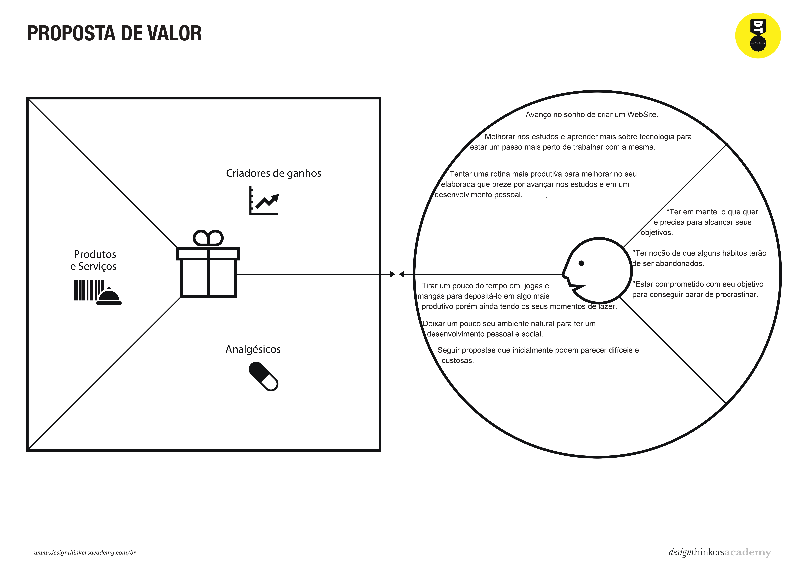

# Product design

Pré-requisitos: <a href="02-Product-discovery.md"> Product discovery</a>

## Histórias de usuários

Com base na análise das **personas**, foram levantadas as seguintes **histórias de usuários**, estruturadas para refletir claramente as necessidades, funcionalidades desejadas e os benefícios esperados:

| **EU COMO... (`Persona`)** | **QUERO/PRECISO... (`Funcionalidade`)** | **PARA... (`Motivo/Valor`)** |
|----------------------------|------------------------------------------|-------------------------------|
| **Aluno do Ensino Médio**  | Receber lembretes das tarefas e horários de estudo | Ter foco, disciplina e senso de urgência para melhorar meu desempenho escolar |
| **Empresário(a)**          | Aplicar estratégias de gestão de tempo e produtividade | Minimizar a procrastinação dentro da empresa, aumentando a eficiência da equipe |
| **Universitário(a)**       | Ter uma ferramenta que me ajude a criar cronogramas acadêmicos e organizar prazos | Cumprir todas as atividades da faculdade e melhorar meu desempenho acadêmico |
| **Empregada doméstica**    | Usar lembretes e divisão de tarefas do dia | Organizar melhor meu tempo e finalizar as tarefas mais rapidamente, sem sobrecarga |
| **Freelancer**             | Controlar o tempo dedicado a cada projeto | Cumprir prazos, evitar atrasos e melhorar minha produtividade profissional |
| **Gestor de Projetos**     | Acompanhar o progresso da equipe e enviar alertas | Garantir que todos estejam focados, evitem distrações e cumpram os prazos do projeto |
| **Pessoa com TDAH**        | Ter alertas visuais e sonoros, além de timers personalizados | Ajudar no foco, na organização e na conclusão de tarefas sem sobrecarga mental |
| **Mãe/Pai**                | Organizar as tarefas domésticas e compromissos familiares | Equilibrar as atividades da casa, trabalho e filhos, evitando o acúmulo de tarefas |
| **Estudante de Concurso**  | Ter um cronômetro para sessões de estudo e divisão por disciplinas | Aumentar o foco, absorver mais conteúdo e se preparar melhor para as provas |

---

## Resumo das Necessidades dos Usuários

- **Organização de Tarefas:** Cadastro, edição, exclusão e categorização.
- **Gestão do Tempo:** Timer Pomodoro, cronômetros personalizados e alarmes.
- **Relatórios de Produtividade:** Visualização de tempo dedicado, tarefas concluídas e pontos de melhoria.
- **Alertas e Notificações:** Para lembretes de tarefas, pausas e sessões de foco.
- **Gestão de Cronogramas:** Facilidade para criar, visualizar e seguir cronogramas pessoais ou profissionais.

*Arthur:
Um dos problemas que persegue Arthur é justamente uma dificuldade em sair da área de conforto, sempre que tenta ou pensa em fazer algo para ir atrás de seus sonhos, acaba tentando achar meios de distrair a sua mente e no final não faz nada do que queria. 
Arthur quer sair da conformidade e procrastinar menos.

*Cláudia:
Cláudia vem tendo alguns problemas com relação ao estudo, está com dificuldade em focar nos estudos, o que deveria ser apenas um alivio para o stress acaba virando uma fuga da realidade e as coisas que deveriam ser feitas viram um bola de neve de coisas acumuladas. 
Ela pretende com a utilização desse serviço tentar achar um jeito de ajeitara sua rotina e se livrar do problema com a procrastinação.

*Lucas:
Lucas quer se sentir mais produtivo, avançar mais no seu estudos para conseguir alcançar nos seus objetivos. Mesmo sendo apenas um adolescente, ele se preciona muito para conquistar as coisas na vida, mas a procrastinação atrapalha muito para alcançar esse objetivo.

## Proposta de valor

**Apresentação dos diagramas das personas usadas no projeto**

##### Proposta para a persona Arthur Morgan 

##### Proposta para a persona Cláudia Diniz 

##### Proposta para a persona Lucas Henrique 

## Requisitos

As tabelas a seguir apresentam os requisitos funcionais e não funcionais que detalham o escopo do projeto.

## Requisitos Funcionais

| ID     | Descrição do Requisito                                                                          | Prioridade (MoSCoW) |
| ------ | ------------------------------------------------------------------------------------------------ | -------------------- |
| RF-001 | Permitir que o usuário cadastre, edite e exclua tarefas.                                         | Must have (M)        |
| RF-002 | Implementar um medidor de progresso através de desafios, conquistas e gamificação.              | Should have (S)      |
| RF-003 | Permitir entrada apenas após realizar login com senha.                                           | Must have (M)        |
| RF-004 | Permitir entrada de novos afazeres pessoais para auxiliar no planejamento diário do usuário.    | Must have (M)        |
| RF-005 | Disponibilizar um cronômetro no modelo Pomodoro para gerenciamento do tempo.                     | Should have (S)      |
| RF-006 | Gerar relatórios de produtividade com base nas tarefas realizadas e no tempo focado.            | Could have (C)       |
| RF-007 | Enviar notificações de lembretes sobre tarefas e sessões de foco.                               | Should have (S)      |

---

## Requisitos Não Funcionais

| ID      | Descrição do Requisito                                                                        | Prioridade (MoSCoW) |
| ------- | --------------------------------------------------------------------------------------------- | -------------------- |
| RNF-001 | O sistema deve ser responsivo e funcionar em dispositivos móveis, tablets e desktops.         | Must have (M)        |
| RNF-002 | O site deve estar disponível 24 horas por dia, 7 dias por semana, com alta disponibilidade.    | Must have (M)        |
| RNF-003 | O sistema deve oferecer integração com o calendário do usuário para envio de notificações.     | Should have (S)      |
| RNF-004 | O tempo de resposta das páginas não deve exceder 2 segundos.                                   | Should have (S)      |
| RNF-005 | O sistema deve ser desenvolvido com tecnologias web padrão: HTML, CSS e JavaScript.           | Must have (M)        |

---

## Restrições

Enumere as restrições à sua solução. Lembre-se de que as restrições geralmente limitam a solução candidata.

O projeto está restrito aos itens apresentados na tabela a seguir.

|ID| Restrição                                             |
|--|-------------------------------------------------------|
|001| O projeto deverá ser entregue até o final do semestre  |
|002| O projeto deverá ser feito por todos os integrantes |
|003| O projeto não terá aplicação para aplicativos móveis (Apps para baixar em celular por exemplo) |
|003| Qualquer mudança significativa terá que ser aceita por todos os integrantes do grupo |
