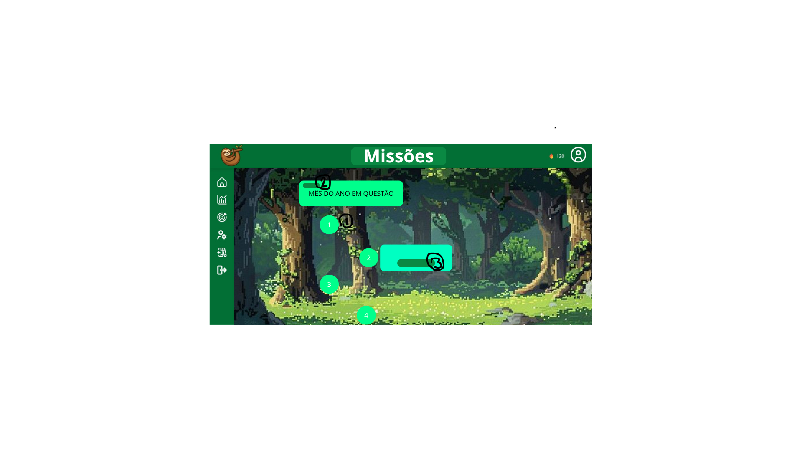
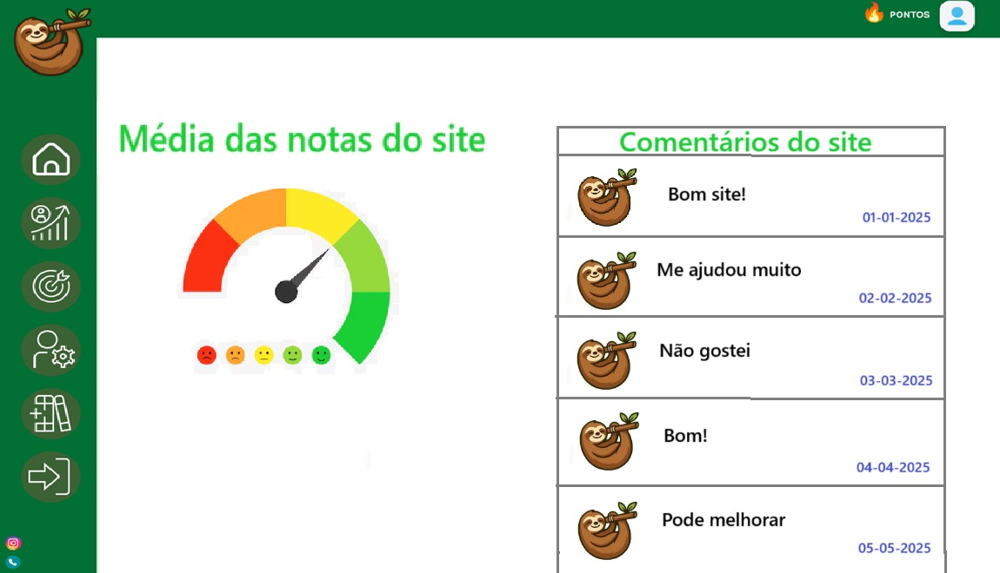
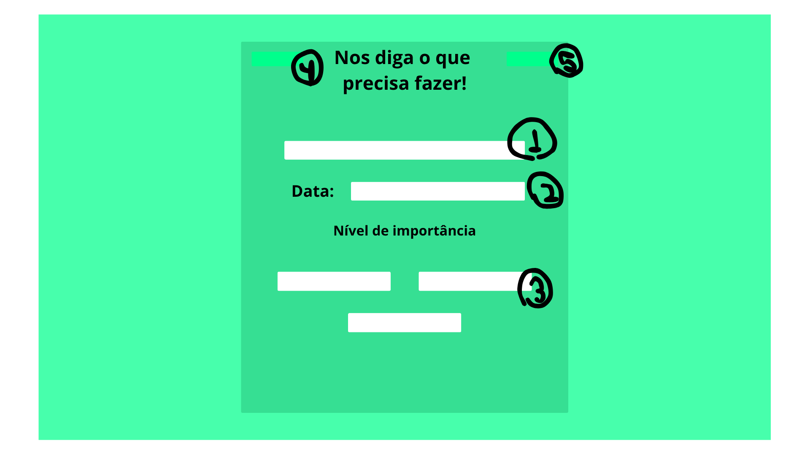

# Projeto de interface

#### 1. Tela Inicial (Home)
A tela inicial apresenta uma navegação direta e objetiva, com acesso rápido às principais seções da plataforma. Foram priorizados elementos visuais leves e uma estrutura limpa, garantindo boa usabilidade.

#### 1. Tela Inicial (Home)
A tela inicial apresenta uma navegação direta e objetiva, com acesso rápido às principais seções da plataforma. Foram priorizados elementos visuais leves e uma estrutura limpa, garantindo boa usabilidade.

#### 2. Tela de Login/Cadastro
A tela de autenticação foi criada com foco na simplicidade e segurança. 

=======
#### 2. Tela de Login/Cadastro
A tela de autenticação foi criada com foco na simplicidade e segurança. 

#### 3. Dashboard / Área do Usuário
Essa interface reúne todas as funcionalidades essenciais em um único lugar. Foi pensada para ser intuitiva, com informações organizadas em blocos visuais e ícones de fácil compreensão.

#### 4. Tela de Tarefas/Funcionalidade Principal
Esta é a interface central da plataforma, que permite ao usuário interagir diretamente com a função principal do projeto (ex: organizar tarefas, enviar conteúdo, consultar informações, etc.).

#### 5. Menu de Navegação e Responsividade
A navegação foi projetada para ser intuitiva tanto em desktop quanto em dispositivos móveis. O menu lateral ou superior permite acesso rápido e direto a todas as áreas da plataforma.

#### 6. Aba de missões
A aba de missões é projetada para deixar a apresentação de dias mais intuitiva e agradavel pro usuario, deixando mais fácil visualizar as tarefas que se tem a fazer durante o mês.

 ## User flow

## Wireframes

### Protótipo Interativo

✅ [Protótipo interativo](https://www.figma.com/proto/kBXYou2bxlPFA4IgAZoxtn/Procastina%C3%A7%C3%A3o?node-id=129-649&t=C0yAS6AaCgyIx21P-1&scaling=min-zoom&content-scaling=fixed&page-id=0%3A1&starting-point-node-id=129%3A649&show-proto-sidebar=1)  
