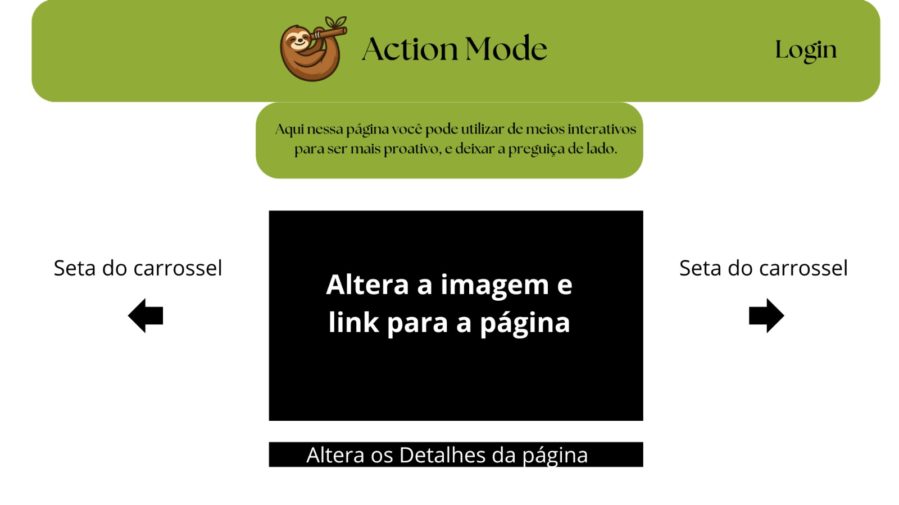
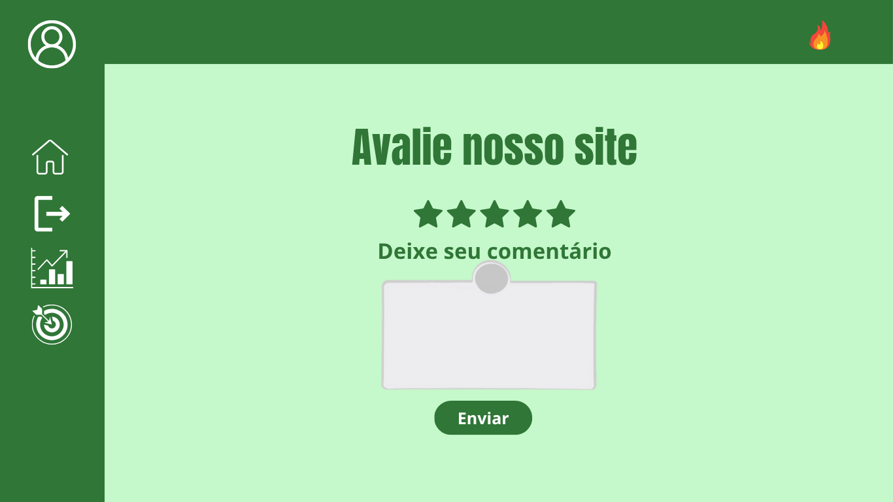

# Projeto de interface

#### 1. Tela Inicial (Home)
A tela inicial apresenta uma navegação direta e objetiva, com acesso rápido às principais seções da plataforma. Foram priorizados elementos visuais leves e uma estrutura limpa, garantindo boa usabilidade, contendo um carrossel com as páginas disponíveis.

#### 2. Tela de Login/Cadastro
A tela de autenticação foi criada com foco na simplicidade e segurança, contendo poucos dados obrigatórios.  

#### 3. Dashboard / Área do Usuário
Essa interface reúne todas as funcionalidades essenciais em um único lugar. Foi pensada para ser intuitiva, com informações organizadas em blocos visuais e ícones de fácil compreensão.

#### 4. Tela de Tarefas/Funcionalidade Principal
Esta é a interface central da plataforma, que permite ao usuário interagir diretamente com a função principal do projeto (ex: organizar tarefas, enviar conteúdo, consultar informações, etc.), por meio de tarefas dinamicas gamificadas. 

#### 5. Menu de Navegação e Responsividade
A navegação foi projetada para ser intuitiva tanto em desktop quanto em dispositivos móveis. O menu lateral ou superior permite acesso rápido e direto a todas as áreas da plataforma.

#### 5. Calendário
O calendário foi projetado visando uma melhor organização das tarefas pendentes e já realizadas, além de funcionar como um marcador, podendo servir para agendamento ou lembrete de alguma tarefa.

#### 6. Área de progresso
Essa área é utilizada para visualizar a progressão do usuário dentro do site, contendo seu histórico de realização das tarefas propostas com margens gráficas de evolução.

#### 7. Página de saiba mais
Uma página contendo informações, fontes, e curiosidades sobre o site, contendo referências sobre a procastinação.

 ## User flow

No ACTION MODE, cada interação é parte da sua jornada de conquistas. Siga o fluxo para transformar a sua produtividade em um jogo envolvente:

## Wireframes

#### Wireframe aba de Entrada ao Site
A página de entrada comunica imediatamente o objetivo do ACTION MODE: ser um meio interativo para a proatividade e combater a procrastinação.

#### Wireframe aba de Entrada de Tarefas
Planejar é o primeiro passo para o sucesso! Utilize a aba Inserir Tarefas para adicionar de forma rápida e intuitiva todas as suas atividades e compromissos. Comece a construir seu caminho de missões e prepare-se para conquistá-los no ACTION MODE.

#### Wireframe aba de Missões
A aba de Missões foi cuidadosamente projetada para transformar a organização diária em uma experiência visualmente intuitiva e altamente engajadora.
Com um layout que facilita a navegação, você poderá visualizar e acompanhar suas tarefas mensais de forma clara e agradável, impulsionando sua jornada rumo à produtividade.

#### Wireframe aba de Avaliações
A aba de Avaliações foi desenvolvida para ser um espaço transparente e colaborativo. Aqui, todos os usuários do ACTION MODE podem consultar as opiniões e experiências de outros membros da comunidade.
Essas avaliações são cruciais para que possamos, enquanto equipe do ACTION MODE, identificar pontos de melhoria contínua e aprimorar cada vez mais a sua jornada no site.

#### Wireframe aba de Entrada de Avaliação do Site
Nós do ACTION MODE prezamos muito pela opnião de nossos usuários para que possamos estar sempre evoluindo e melhorando nosso site, tornando a experiencia agradavel para o máximo de pessoas possivel. 
Pensando nisso, fizemos a aba para entrada de Avaliações do site.

#### Wireframe aba de Editar Perfil
A seção Editar Perfil é o seu centro de comando pessoal. Aqui, você pode gerenciar e atualizar todas as suas informações com segurança, além de ajustar as configurações para otimizar sua interação com o ACTION MODE.

### Protótipo Interativo

Aqui, apresentamos uma breve experiência de como será a navegação em nosso site. O projeto ACTION MODE busca proporcionar uma jornada agradável e satisfatória para o usuário, por meio de uma abordagem de gamificação.
Nessa experiência, as tarefas são tratadas como missões a serem cumpridas, e você será recompensado(a) com o ganho de pontos a cada conquista.

✅ [Protótipo interativo](https://www.figma.com/proto/kBXYou2bxlPFA4IgAZoxtn/Procastina%C3%A7%C3%A3o?node-id=129-649&t=C0yAS6AaCgyIx21P-1&scaling=min-zoom&content-scaling=fixed&page-id=0%3A1&starting-point-node-id=129%3A649&show-proto-sidebar=1)  
