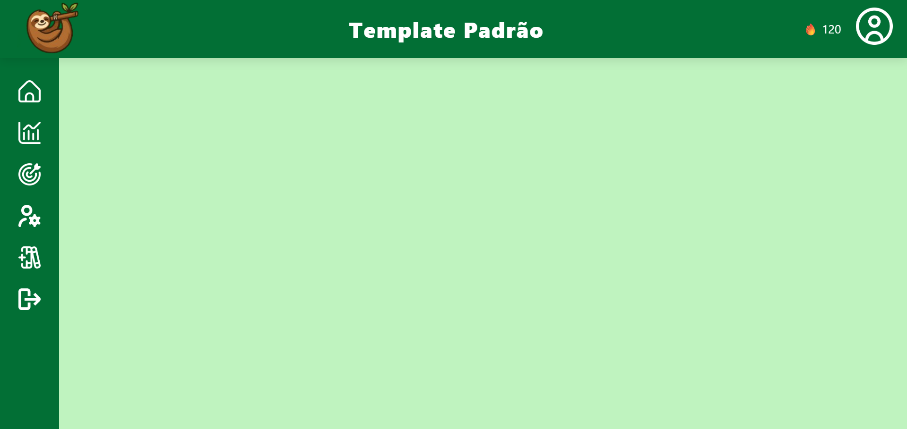

# Template padrão da aplicação

O layout foi pensado para pessoas que têm problemas com procrastinação. Por isso, montamos a interface com o objetivo de otimizar ao máximo o uso, utilizando, por exemplo, botões de acesso rápido na barra lateral, que permitem navegar com agilidade pelas funções do site.

Uma das decisões visuais foi o uso de uma preguiça como logotipo, pois ela representa bem o sentimento de quem procrastina. A cor verde também foi escolhida com base na logo e em pesquisas que apontam seus efeitos positivos no cérebro. Estudos mostram que o verde (assim como o azul) ativa o córtex pré-frontal, responsável pela memória de trabalho — que acessa informações adquiridas e mantém o foco na atividade em execução.

“O azul e o verde ativam o córtex pré-frontal. Este é responsável pela memória de trabalho, que acessa a memória adquirida e retém a memória da atividade que está sendo executada.”
Disponível em: https://rhpravoce.com.br/colab/neurociencia-das-cores-pode-estimular-produtividade
Acesso em: 01/05/2025.
